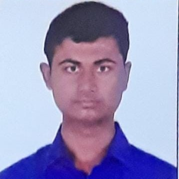

# Nipun B Nair

I am a final-year Computer science and Artificial Intelligence major at Amrita Vishwa Vidhyapeetham, Bangalore, where my main interests lie in the **Generative AI** field. Outside of class, my research primarily includes democratizing generative AI into various indic languages. My other hobbies include dancing, singing, writing, chess, cricket, movies and learning new languages.

- Email: [nipunbnair@gmail.com](mailto:nipunbnair@gmail.com)
- [CV](Nipun08_08_2023_Resume.pdf)
- [Google Scholar](https://scholar.google.co.in/citations?hl=en&user=mefMP2gAAAAJ)

## Research

The primary aim of my research is to democratize the capabilities of Generative Artificial Intelligence (AI) by extending its reach to encompass a multitude of Indic languages. With the advent of cutting-edge technologies like Generative AI, the potential for creative content generation, language translation, and cultural expression has surged remarkably. However, there exists a notable gap in its application to Indic languages, which are rich in diversity and heritage. By bridging this gap, my research endeavors to empower communities that communicate through Indic languages to leverage Generative AI for content creation, communication, and artistic expression. This pursuit holds the promise of not only preserving and revitalizing linguistic traditions but also fostering innovation and inclusivity in the digital era.

## Publications & Preprints

### Deployment of Breast Cancer Hybrid Net using Deep Learning

**Nipun B Nair**, Dr Tripti Singh, Dr Amrita Thakur, Dr Prakash Duraisamy

2022

Breast cancer (BC) occurs when healthy breast cells grow out of control and become tumors. According to American Cancer Society, breast cancer occurs in one out of eight women and in one out of thousand men. Early breast cancer detection is thus important to give the maximum chance of survival for the patient. Breast biopsy is used to analyze the breast cells and diagnose whether the sample of cells contain breast cancer. It is an invasive method and manually analyzed by a pathologist under a microscope. There is a chance of human error in such a method, and it is time consuming. Oncologist can diagnose breast cancer at a faster and accurate and less painful way if they use machine learning and image classification algorithms. One of the best machine learning techniques is Support Vector Machine. If it is combined with the computational power of Convolutional Neural Network, it becomes an immensely powerful classification algorithm. Support Vector Machine and Convolutional Neural Network model gives better accuracy than other image classifiers such as VGG16, RESNET 50, and INCEPTIONV3 models. This research is to design Deployment of Breast Cancer Hybrid Net using Deep Learning For research dataset of 3538 images was deployed. During research experiments SVM-CNN, VGG16, RESNET 50, and INCEPTIONV3 models accuracy reported were 93.35%, 89.54%, 92.45% and 88.6% respectively.
